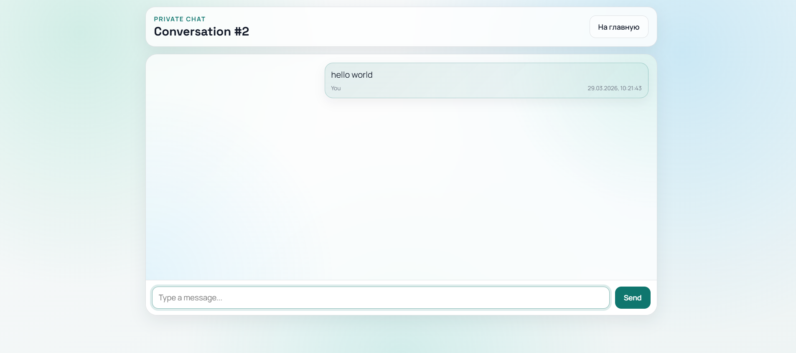
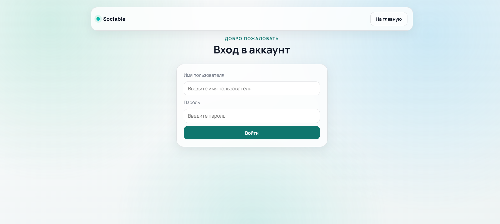
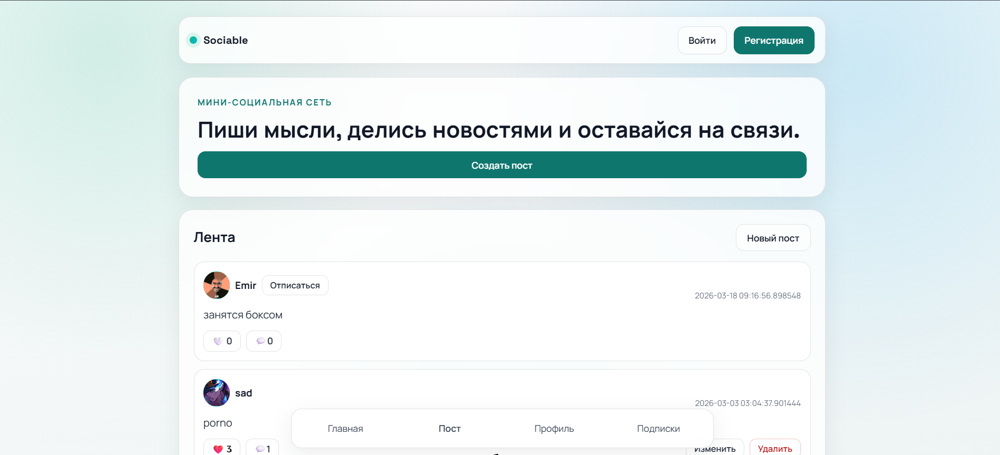
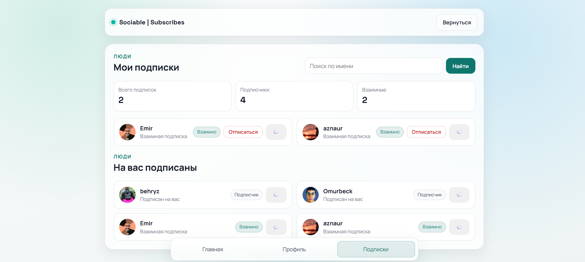

# 🚀 Social Network

Простая социальная сеть с поддержкой чатов в реальном времени.

## ✨ Возможности

* 🔐 Аутентификация пользователей
* 💬 Чаты в реальном времени (WebSocket)
* 🔎 Поиск пользователей
* 👥 Добавление в контакты

---

## 🛠️ Стек технологий

* **Backend:** FastAPI
* **База данных:** PostgreSQL
* **Реальное время:** WebSocket
* **ORM:** SQLAlchemy

---

## ⚙️ Установка и запуск

### 1. Клонировать репозиторий

```bash
git clone https://github.com/sad5x30/Social-Network.git
cd Social-Network
```

### 2. Создать виртуальное окружение

```bash
python -m venv venv
venv\Scripts\activate  # Windows
```

### 3. Установить зависимости

```bash
pip install -r requirements.txt
```

### 4. Настроить переменные окружения

Создай файл `.env` и заполни его по примеру:

```
DATABASE_URL=your_database_url
SECRET_KEY=your_secret_key
```

---

### 5. Запустить проект

```bash
uvicorn main:app --reload
```

После запуска:
👉 http://127.0.0.1:8000

---

## 📸 Скриншоты

### 💬 Чат



### 🔐 Авторизация



### Главная страница


### Подписки


---

## 🧠 Планы по развитию

* [ ] Уведомления
* [ ] Групповые чаты
* [ ] Улучшение UI
* [ ] Деплой проекта

---

## 📁 Структура проекта

```
project/
│
├── models/        # Модели базы данных
├── routes/        # Роуты (API)
├── services/      # Бизнес логика
├── templates/     # HTML шаблоны
├── static/        # CSS / JS
└── main.py        # Точка входа
```

---

## 👨‍💻 Автор

Aznaur
GitHub: https://github.com/sad5x30

